# 基于springboot+vue的车辆管理系统

<h4 style='color:red'>联系不到我，就看我的主页 </h4> 
 
#### 介绍

在现代社会，车辆管理的规范化和高效化对于企业和组织的运营至关重要。本基于 Spring Boot + Vue 的车辆管理系统旨在为各类单位提供一套全面、便捷、可靠的车辆管理解决方案，以提高车辆管理的效率和质量，降低运营成本，保障车辆的安全和正常使用。

#### 技术栈

后端技术栈：Springboot+Mysql+Maven

前端技术栈：Vue+Html+Css+Javascript+ElementUI

开发工具：Idea+Vscode+Navicate

#### 系统功能介绍

（一）管理员角色  
个人中心：  
查看和修改个人信息，如用户名、密码、联系方式等。  
查看个人操作日志和系统通知。  
员工管理：  
新增员工信息，包括员工姓名、工号、部门、职位等。  
编辑员工信息，如岗位调整、联系方式变更等。  
删除离职员工的信息。  
为员工分配不同的车辆管理权限。  
证件信息管理：  
录入和更新车辆相关证件信息，如行驶证、驾驶证等。  
设置证件的有效期提醒，确保证件及时更新。  
查看证件的历史记录和审核状态。  
车辆信息管理：  
登记车辆的基本信息，如车型、车牌号、车架号、购置日期等。  
跟踪车辆的使用状态，如在用、闲置、报废等。  
对车辆进行分类和分组管理，方便查询和统计。  
业务单据管理：  
处理车辆的各类业务单据，如出车申请单、报销单等。  
审核单据的真实性和合理性。  
统计和分析业务单据的数据，为决策提供支持。  
事故登记管理：  
记录车辆事故的详细信息，包括事故时间、地点、原因、责任认定等。  
上传事故相关的图片和文件。  
跟踪事故处理的进度和结果。  
维修登记管理：  
登记车辆的维修记录，包括维修时间、维修项目、维修费用等。  
选择维修厂和维修人员。  
评估维修效果和质量。  
保养登记管理：  
制定车辆的保养计划，设置保养周期和提醒。  
记录保养的实际执行情况，如保养项目、保养费用等。  
分析保养数据，优化保养策略。  
加油登记管理：  
记录车辆的加油信息，如加油时间、加油量、加油金额等。  
统计车辆的油耗情况。  
分析加油数据，控制燃油成本。  
违章信息管理：  
录入车辆的违章信息，如违章时间、地点、违章内容、罚款金额等。  
跟踪违章处理的情况。  
对违章数据进行分析，加强驾驶员管理。  
（二）员工角色  
个人中心：   
查看和修改个人信息，如联系方式等。  
查看个人负责的车辆管理任务和通知。  
证件信息管理：  
查看本人负责车辆的证件信息。  
提醒管理员证件的更新需求。  
车辆信息管理：  
查看所负责车辆的详细信息。  
上报车辆的异常情况。  
业务单据管理：  
提交车辆相关的业务单据，如出车申请、报销申请等。  
查看单据的审批进度。  
事故登记管理：  
上报车辆事故的情况。  
配合事故处理的相关工作。  
维修登记管理：   
申请车辆维修，并说明维修需求。  
查看维修进度和结果。  
保养登记管理：  
按照保养计划进行保养申请。  
反馈保养效果。  
加油登记管理：  
上报车辆加油信息。  
协助分析油耗情况。  
违章信息管理：  
上报车辆违章信息。  
按照要求处理违章。  

#### 系统作用

提高管理效率  
实现了车辆管理的信息化和自动化，减少了繁琐的手工记录和文件处理工作。  
快速准确地获取车辆相关信息，提高了决策的及时性和科学性。  
简化了业务流程，提高了车辆管理各个环节的工作效率。  

保障车辆安全  
及时记录和跟踪车辆的事故、维修、保养等情况，确保车辆处于良好的运行状态。  
对驾驶员的违章行为进行有效管理，提高驾驶安全性。  
通过证件信息管理，保证车辆和驾驶员的合法合规。  

降低运营成本  
合理规划车辆的使用、保养和维修，延长车辆使用寿命，降低购置成本。  
对加油、维修等费用进行精确统计和分析，控制成本支出。  
优化车辆调度，提高车辆利用率，减少闲置浪费。  

提升服务质量  
为员工提供便捷的车辆使用和管理渠道，提高员工满意度。  
及时响应员工的车辆需求，提升服务水平。  
准确记录车辆服务信息，为服务质量评估提供依据。  

增强数据管理和分析能力  
系统积累了大量的车辆管理数据，为数据分析和挖掘提供了基础。  
通过对数据的分析，可以发现车辆管理中的问题和趋势，为改进管理策略提供支持。  

#### 系统功能截图

代码结构

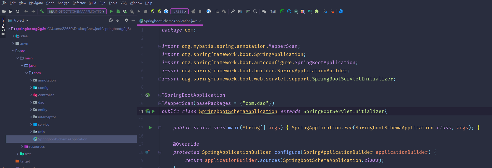

数据库表

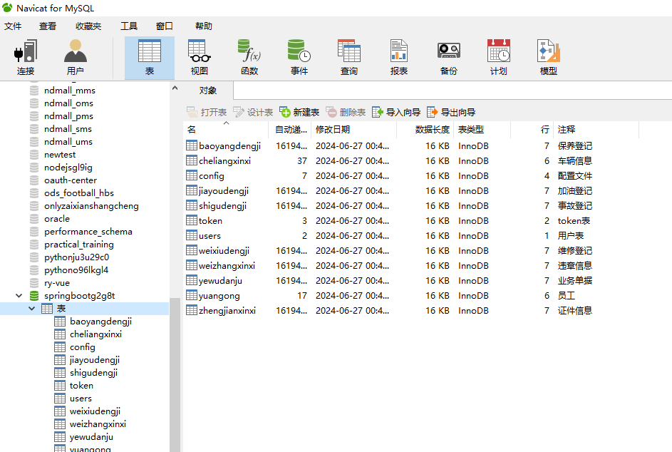

登录

员工管理

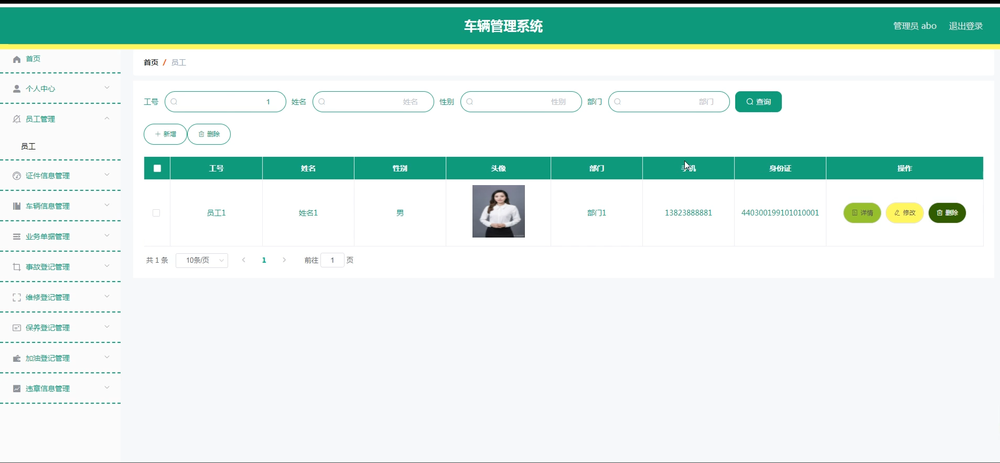

车辆信息管理

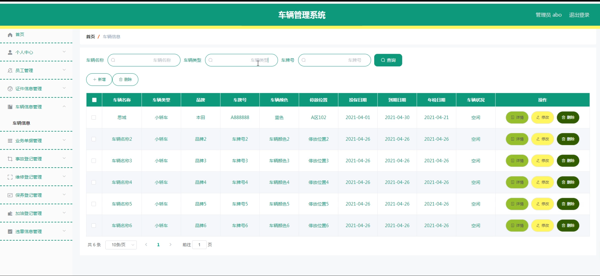

业务单据管理

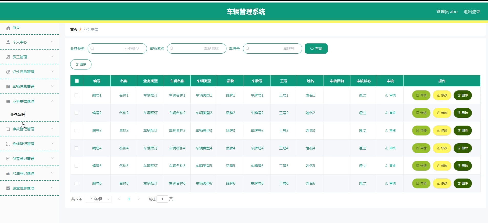

员工端个人信息

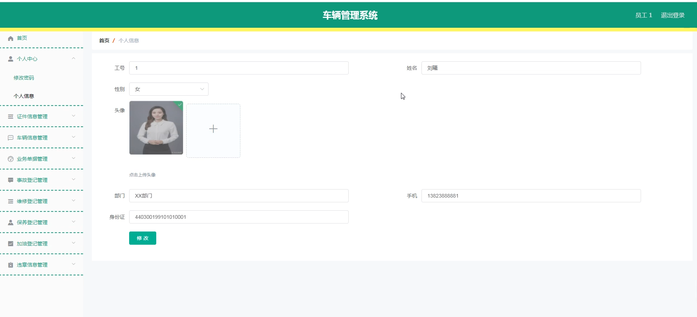

事故登记管理

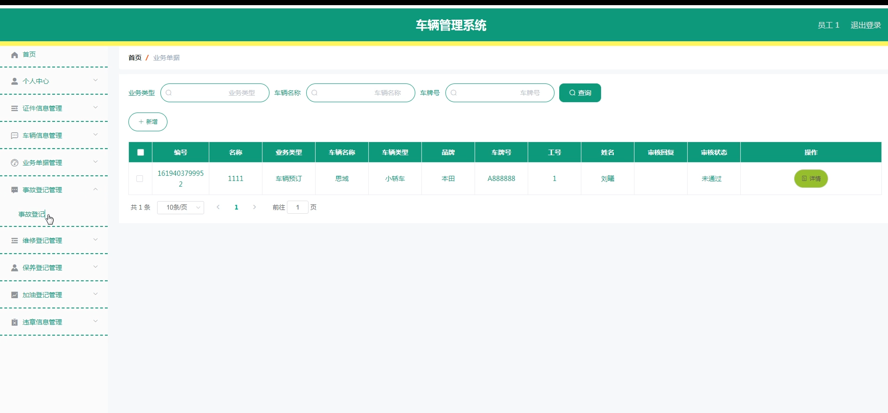

维修登记管理

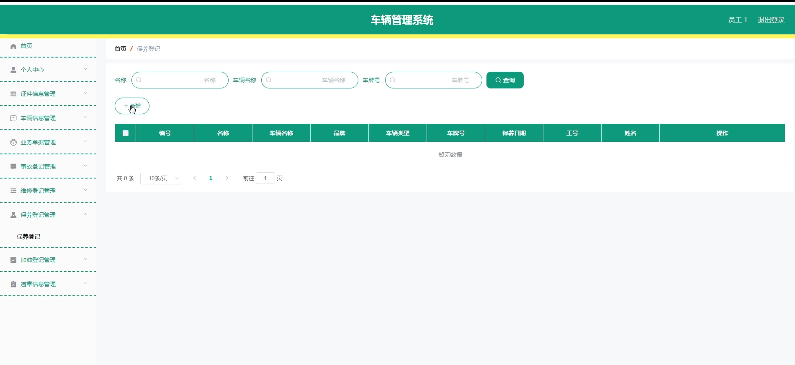

保养登记管理

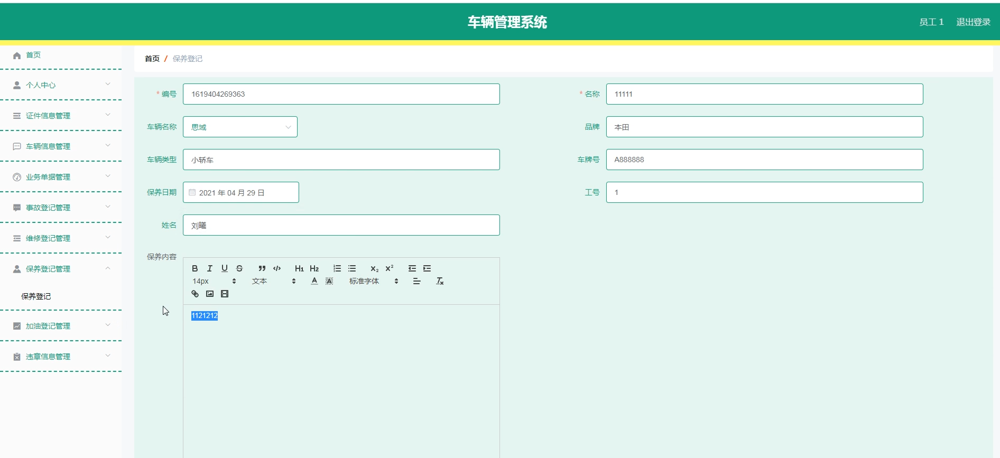

加油登记管理

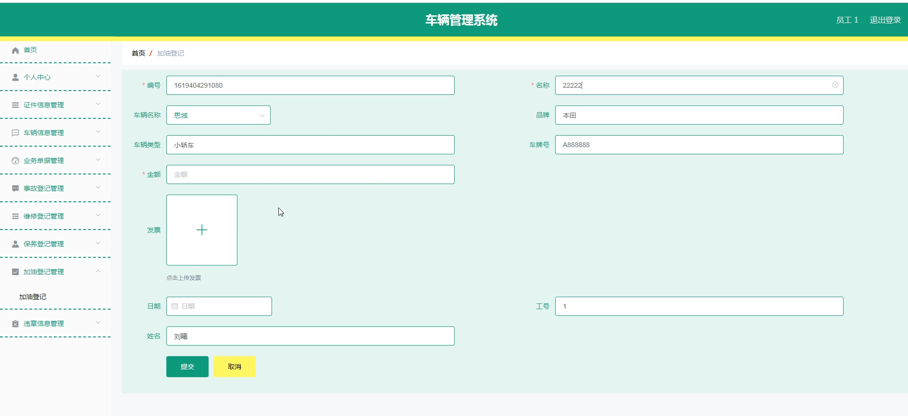

违章信息管理

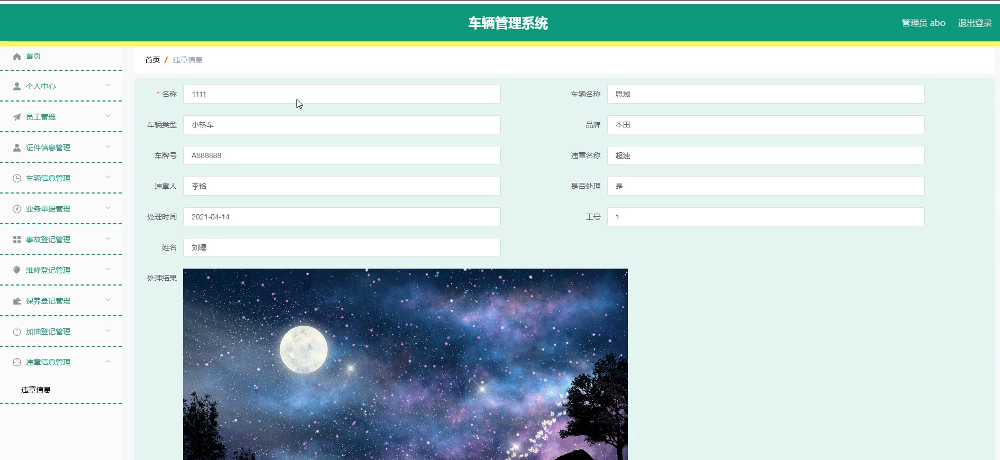

#### 总结

本基于 Spring Boot + Vue 的车辆管理系统，通过清晰的角色划分和全面的功能模块，为车辆管理提供了高效、便捷、可靠的解决方案。无论是管理员还是员工，都能在系统中实现各自的管理和操作需求。该系统不仅提升了车辆管理的效率和质量，还降低了成本，保障了安全，为单位的正常运营提供了有力支持。随着技术的不断发展和业务需求的变化，系统还将不断优化和完善，以适应新的挑战和机遇。

#### 使用说明

创建数据库，执行数据库脚本 修改jdbc数据库连接参数 下载安装maven依赖jar 启动idea中的springboot项目

后台地址：http://localhost:8080/springbootg2g8t/admin/dist/index.html

管理员  abo 密码 abo

